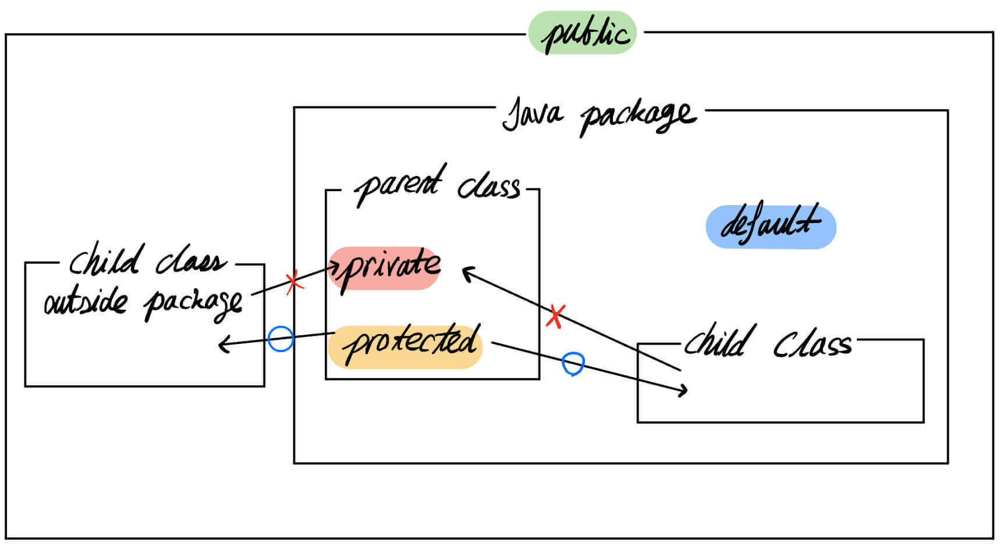
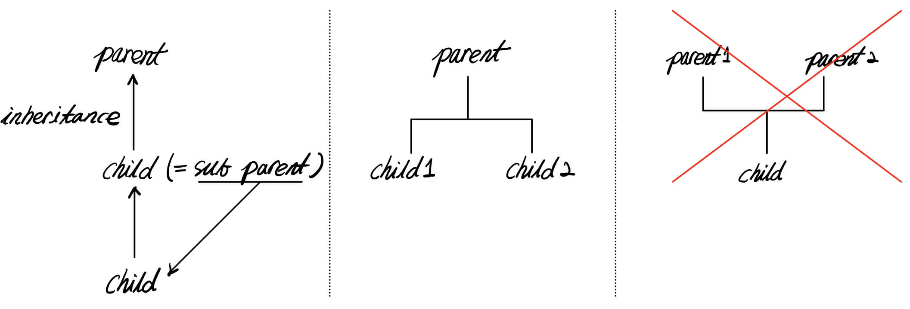
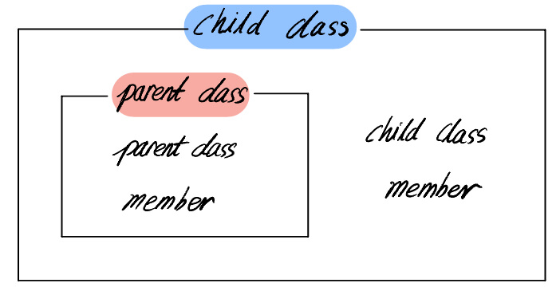

- [Java 기초](#java-기초)
  - [변수와 자료형](#변수와-자료형)
  - [여러가지 연산자](#여러가지-연산자)
  - [조건문](#조건문)
  - [반복문](#반복문)
  - [다차원 배열](#다차원-배열)
  - [✅ 클래스와 객체](#클래스와-객체)
    - [클래스 (class)](#클래스-class)
    - [객체, 인스턴스](#객체-인스턴스)
    - [클래스 사용](#클래스-사용)
    - [`this`, `this()`](#this-this)
    - [생성자](#생성자)
    - [실습](#실습)
    - [오버로딩 (Overloading)](#오버로딩-overloading)
    - [실습](#실습-1)
    - [접근제한자 (Access Modifier)](#접근제한자-access-modifier)
    - [Static](#static)
    - [**실습**](#실습-2)
  - [✅ 상속](#상속)
    - [상속 (Inheritance)](#상속-inheritance)
    - [`super`, `super()`](#super-super)
    - [오버라이딩 (Overriding)](#오버라이딩-overriding)
    - [**실습**](#실습-3)
  - [✅ 다형성](#다형성)
    - [다형성 (Polymorphism)](#다형성-polymorphism)
    - [**실습**](#실습-4)
    - [`instanceof`](#instanceof)
    - [**실습**](#실습-5)
  - [✅ 추상 클래스](#추상-클래스)
    - [추상 메소드 (Abstract Method)](#추상-메소드-abstract-method)
    - [추상 클래스 (Abstract class)](#추상-클래스-abstract-class)
    - [추상 클래스 실습](#추상-클래스-실습)
  - [✅ 인터페이스](#인터페이스)
    - [인터페이스](#인터페이스-1)
    - [상속과 인터페이스 동시 사용](#상속과-인터페이스-동시-사용)
    - [실습](#실습-6)
  - [✅ 내부 클래스, 익명 클래스](#내부-클래스-익명-클래스)
    - [내부 클래스 (Inner Class)](#내부-클래스-inner-class)
    - [익명 클래스 (Anonymous class)](#익명-클래스-anonymous-class)
    - [실습](#실습-7)
  - [✅ 입출력](#입출력)
    - [콘솔 입력](#콘솔-입력)
    - [콘솔 출력](#콘솔-출력)
    - [실습](#실습-8)
    - [정수, 문자열 변환](#정수-문자열-변환)
    - [출력 포맷](#출력-포맷)
  - [✅ 파일 입출력](#파일-입출력)
    - [파일 출력](#파일-출력)
    - [파일 입력](#파일-입력)
    - [실습 - 파일 쓰기](#실습---파일-쓰기)
    - [실습 - 파일 읽기](#실습---파일-읽기)
    - [Practice](#practice)
  - [✅ 예외 처리](#예외-처리)
    - [예외 (Exception)](#예외-exception)
    - [예외 처리 (Exception Handling)](#예외-처리-exception-handling)
    - [finally](#finally)
    - [throw, throws](#throw-throws)
    - [실습](#실습-9)
  - [컬렉션 프레임워크](#컬렉션-프레임워크)
  - [람다식](#람다식)
  - [스트림](#스트림)
  - [연습 문제](#연습-문제)

# Java 기초

## 변수와 자료형

## 여러가지 연산자

## 조건문

## 반복문

## 다차원 배열

## 클래스와 객체

- 클래스와 객체의 관계를 이해
- 기본 사용 방법과 생성자 및 this의 사용

### 클래스 (class)

- object를 정의하는 blueprint
    - 예) 자동차 설계도
        - (특성) 디자인, 무게, 가격
        - (기능) horn, break
    - 실체화 → car1, car2, …
- 쿠키 커터 → 쿠키1, 쿠키2, …, 쿠키n
- 요리법 → 요리1, 요리2, …., 요리n

> 🧷 객체; 사물, 실체
> 

### 객체, 인스턴스

- 객체 (Object)
    - class가 실체화된 것 (= instance)
- 인스턴스 (Instance)
    - class와 object의 관계 (📌  this object is the instance of this class)
    - class로부터 object를 선언 (인스턴스 화)

### 클래스 사용

- object variable, method로 이루어짐

```java
	public class 클래스명 {
    // 객체 변수
    // 메소드 리턴타입 메소드명 (파라미터) {}
    // + 접근제어자
    // + static
}

클래스명 객체명 = new 클래스명();
```

### `this`, `this()`

- `this`
    - 현재의 object 자신을 의미
- `this()`
    - constructor 호출

### 생성자

- object가 생성될 때 자동으로 호출됨
    - `new 클래스명();`
- 규칙
    - class명과 이름 맞추기
    - no return type
    - constructor 가 여러개 올 수 있다 (= 오버로딩)

```java
public class 클래스명 {
    클래스명() { // 생성자
}
```

### 실습

```java
class Car { // class define
    String name; // field
    String type;

    Car() { // create constructor
    }

    Car(String name, String type) { // constructor overloading
        this.name = name;
        this.type = type;
        System.out.println("Constructor activate");
    }

    public void printCarInfo() { // method
        System.out.println("== Car Info ==");
        System.out.println("name = " + name);
        System.out.println("type = " + type);
    }

    public void move() {
        System.out.println("move" + this.name);
    }

    public void brake() {
        System.out.println("break active of" + this.name);
    }
}

public class Main {

    public static void main(String[] args) {
        Car myCar1 = new Car();
        myCar1.name = "MQ4";
        myCar1.type = "SUV";
        myCar1.printCarInfo();
        myCar1.move();
        myCar1.brake();

        System.out.println("");

        Car myCar2 = new Car("GRANDEUR", "Sedan");
        myCar2.printCarInfo();
        myCar2.move();
        myCar2.brake();
    }
}
```

**실행 결과**

```java
== Car Info ==
name = MQ4
type = SUV
moveMQ4
break active ofMQ4

Constructor activate
== Car Info ==
name = GRANDEUR
type = Sedan
moveGRANDEUR
break active ofGRANDEUR
```

### 오버로딩 (Overloading)

- 한 class 내에서 같은 이름의 method를 중복하여 정의 (📌 **polymorphism**)
- 조건
    - method 이름이 같아야 함
    - parameter의 개수 또는 type이 달라야 함
    - return type 차이로는 overloading이 되지 않음

```java
public class 클래스명 {
    클래스명(){}
    클래스명(String name, String type) { // constructor overloading
    // statement
    }
}
```

### 실습

```java
class Car {
    String name;
    String type;

    Car() {

    }

    Car(String name, String type) {
        this.name = name;
        this.type = type;
        System.out.println("Constructor activate");
    }

    public void printCarInfo() {
        System.out.println("== Car Info ==");
        System.out.println("name = " + name);
        System.out.println("type = " + type);
    }

    public void printCarInfo(String date) {
        this.printCarInfo();
        System.out.println("date = " + date);
    }

    public void printCarInfo(int number) { // method overloading
        this.printCarInfo();
        System.out.println("number = " + number);
    }

    public void printCarInfo(String date, int number) {
        this.printCarInfo();
        System.out.println("date = " + date);
        System.out.println("number = " + number);
    }

    public void move() {
        System.out.println("move" + this.name);
    }

    public void brake() {
        System.out.println("break active of" + this.name);
    }
}

public class Main {

    public static void main(String[] args) {
        Car myCar1 = new Car();
        myCar1.name = "MQ4";
        myCar1.type = "SUV";
        myCar1.printCarInfo();
        myCar1.move();
        myCar1.brake();

        System.out.println("");

        Car myCar2 = new Car("GRANDEUR", "Sedan");
        myCar2.printCarInfo();
        System.out.println("== overloading ==");
        myCar2.printCarInfo("2023-03-03");
        myCar2.printCarInfo(1234);
        myCar2.printCarInfo("2023-03-03", 1234);
        myCar2.move();
        myCar2.brake();
    }
}
```

💻 **실행 결과**

```java
== Car Info ==
name = MQ4
type = SUV
moveMQ4
break active ofMQ4

Constructor activate
== Car Info ==
name = GRANDEUR
type = Sedan
== overloading ==
== Car Info ==
name = GRANDEUR
type = Sedan
date = 2023-03-03
== Car Info ==
name = GRANDEUR
type = Sedan
number = 1234
== Car Info ==
name = GRANDEUR
type = Sedan
date = 2023-03-03
number = 1234
moveGRANDEUR
break active ofGRANDEUR 
```

### 접근제한자 (Access Modifier)



- class의 variable나 method의 access에 제한을 두는 키워드
- 종류
    - private: 해당 class에서만 접근 가능
    - public: 접근 제한 없음
    - default: 해당 package 내에서만 접근 가능
    - protected: 해당 package 및 상속받은 class에서 접근 가능

> 🧷 package; 여러 클래스가 모여있는 구분
> 

### Static

- variable이나 method의 특성을 바꾸는 키워드
- 특징
    - memory에 한번만 할당
    - 즉, static variable이나 method는 공유되는 특성을 가짐
- static class variable
    - 해당 class의 각 object들이 값을 공유
- static class method
    - object를 생성하지 않아도 호출 가능

### **💻 실습**

```java
class StaticCar {
    static String name = "Name";
    String type;

    StaticCar(String name, String type) {
        this.name = name;
        this.type = type;
    }

    public void printCarInfo() {
        System.out.println("== Car Info ==");
        System.out.println("name = " + name);
        System.out.println("type = " + type);
    }
    
    public static void getName() {
        System.out.println("name = " + name);
    }
}

public class Main {

    public static void main(String[] args) {
//        static
        System.out.println("=== static ===");
        StaticCar.getName();

        StaticCar staticCar_1 = new StaticCar("1", "sedan");
        StaticCar staticCar_2 = new StaticCar("2", "suv");
        StaticCar staticCar_3 = new StaticCar("3", "rv"); // 이 값이 최종적으로 이용
        staticCar_1.printCarInfo();
        staticCar_2.printCarInfo();
        staticCar_3.printCarInfo();
    }
}
```

**실행 결과**

```java
=== static ===
name = Name
== Car Info ==
name = 3
type = sedan
== Car Info ==
name = 3
type = suv
== Car Info ==
name = 3
type = rv
```

> 🧷 static method를 사용하기에 앞서 method 내에서 field가 사용된다면 static으로 선언해서 memory에 미리 올려야한다.  
🧷 만약 new를 이용해서 새로운 object를 만들었을때, static variable은 서로 공유되는 특성이 있기 때문에 값을 변경하게 되면 모든 object들이 그 값을 가지게 된다.
> 

## 상속

### 상속 (Inheritance)

- 기존 class에 기능 추가 및 재정의하여 새로운 class를 정의
    - parent class: 상속 대상이 되는 기존 class (= 상위 class, 기초 class)
    - child class: 기존 class를 상속하는 class (= 하위 class, 파생 class)
- 📌부모 class의 **field**와 **method**가 상속됨
    - constructor, ❓ **초기화 블록**은 상속되지 않음



- 다중 상속은 불가능
- private, default 멤버는 child class에서 접근 불가

```java
class 자식 클래스명 extends 부모 클래스명 {
    // 필드;
    // 메소드;
}
```



### `super`, `super()`

> 🧷 `this`와 유사함
> 
- `super`
    - parent class와 child class의 멤버 이름이 같을 때 구분하는 키워드
- `super()`
    - parent class의 constructor 호출

### 오버라이딩 (Overriding)

> 🧷 오버로딩과 구분
> 
- parent class의 method를 child class에서 재정의
- 조건
    - method의 선언부는 parent class의 method와 동일해야 함
    - return type에 한해,
        - ❓ parent의 return type으로 변환할 수 있는 type으로 변경 가능
        - parent class의 method보다 access modifier를 더 좁은 범위로 변경 불가
        - parent class의 method보다 더 큰 범위의 예외 선언 불가

### **💻 실습**

```java
class Main {
    public static void main(String[] args) {
        Student myStudent = new Student("this", "super");
        myStudent.getName();
    }

}

class Person {
    String name;
    int age;

    Person() {
    }

    Person(String name, int age) {
        this.name = name;
        this.age = age;
    }
}

class Student extends Person {
    String name;

    Student(String name, int age) {
        super(name, age);
    }

    Student(String name1, String name2) {
        this.name = name1;
        super.name = name2;
    }

    void getName() {
        System.out.println("this.name = " + this.name);
        System.out.println("super.name = " + super.name);
    }
}
```

## 다형성

- 다형성이 무엇인지 설명
- 다형성 개념을 이해하고 직접 구현

### 다형성 (Polymorphism)

- 한 객체가 여러 가지 타입을 가질 수 있는 것
- 부모클래스 타입의 참조 변수로 자식클래스 인스턴스 참조
    - 예) 엔진(Parent) → 6기통 (child) or 4기통 (child) 갈아 끼운다
- **📌 parent의 type을 가진 child instance가 parent의 자신의 method를 사용할 수 없는 경우**
    - parent class에 존재하며, overriding이 안되어있는 method는 사용할 수 없다. type 만큼의 권한을 가진다.
- 📌 Student class를 Parent class의 type을 할당하는 것을 업케스팅이라고 한다.
    - 이것을 다시 student class type을 가진 변수로 하여금 pointer를 돌리면, 에러가 발생한다.
    - 해결 방법: Parent class의 type을 가진 Studen class를 Student class type으로 다운 캐스팅한다

```java
class Person {}
class Student extends Person {}

Person p1 = new Student();
// Student s1 = new Person(); // 불가능
```

### **실습**

```java
class Car {
    Car() {}
    public void horn() {
        System.out.println("horn");
    }
}

class FireTruck extends Car {
    public void horn() {
        System.out.println("FireTruck");
    }
}

class Ambulance extends Car {
    public void horn() {
        System.out.println("Ambulance");
    }
}

class Main {
    public static void main(String[] args) {
        // test code
        Car car = new Car();
        car.horn();

        car = new FireTruck();
        car.horn();

        car = new Ambulance();
        car.horn();
    }
}
```

- 다형성을 이용하여 다음과 같이 코드를 작성할 수 있다:
    - Car type의 array를 만들어 각각의 instance를 생성해서 담는다
    - for each를 이용하여 각각의 `horn()` method를 실행

```java
Car[] car2 = {new Car(), new FireTruck(), new Ambulance()};

        for (Car item : car2) {
            item.horn();
        }
```

### `instanceof`

- 실제 참조하고 있는 인스턴스의 **타입 확인**
- return type ⇒ boolean

```java
class Person {}
class Student extends Person{}

Person p1 = new Student();
// Student s1 = new Person();
System.out.println(p1 instanceof Person);
```

- 📌 다형성을 사용할 수 있는지 확인?

```java
        if (pe1 instanceof Student) {
            Student stu1 = (Student) pe1;
        }

        if (st1 instanceof Person) {
            Person per1 = (Person) st1;
        }
```

### **💻 실습**

```java
class Person {
    public void print() {
        System.out.println("Person.print");
    }
}

class Student extends Person {
    public void print() {
        System.out.println("Student.print");
    }

    public void print2() {
        System.out.println("Student.print2");
    }
}

class CollegeStudent extends Person {
    public void print() {
        System.out.println();
    }
}

public class Main {
    public static void main(String[] args) {
        System.out.println("=== polymorphism ===");
        Person p1 = new Person();
        Student s1 = new Student();

        Person p2 = new Student();
//        Student s2 = new Person();

        Person p3 = new CollegeStudent();
//        CollegeStudent c1 = new Student();

        p1.print();
        s1.print();
        s1.print2();
        p2.print();
//        p2.print2(); // type 에 맞게끔 접근할 수 있다.

        System.out.println("=== type conversion ===");
        Person pp1 = null;
        Student ss1 = null;

        Person pp2 = new Person();
        Student ss2 = new Student();
        Person pp3 = new Student(); // up casting: Student class -> Person type

        pp1 = pp2;
        pp1 = ss2;

        ss1 = ss2;
//        ss1 = pp2;
        ss1 = (Student) pp3; // type casting Person type -> Student type

        CollegeStudent cc1;
        CollegeStudent cc2 = new CollegeStudent();

//        ss1 = (Student) cc2; // child 간의 type 공유는 불가능
//        cc1 = (CollegeStudent) ss1;

        System.out.println("=== instanceof ===");
        Person pe1 = new Person();
        Student st1 = new Student();
        Person pe2 = new Student();
        Person pe3 = new CollegeStudent();

        System.out.println(pe1 instanceof Person); // true?
        System.out.println(pe1 instanceof Student); // false?

        System.out.println(st1 instanceof Student); // true?
        System.out.println(st1 instanceof Person); // true?

        System.out.println(pe2 instanceof Person); // true?
        System.out.println(pe2 instanceof Student); //  true?

        System.out.println(pe3 instanceof Person); // true?
        System.out.println(pe3 instanceof CollegeStudent); // true?

        if (pe1 instanceof Student) {
            Student stu1 = (Student) pe1;
        }

        if (st1 instanceof Person) {
            Person per1 = (Person) st1;
        }
    }
}
```

## 추상 클래스

- 추상 클래스가 무엇인지 설명
- abstract를 이용하여 추상 클래스 구현

### 추상 메소드 (Abstract Method)

- 자식 클래스에서 반드시 오버라이딩 해야하는 메소드
- 선언만하고 구현 내용 없음

```java
abstract void print();
```

### 추상 클래스 (Abstract class)

- 하나 이상의 추상 메소드를 포함하는 클래스
- 반드시 구현해야 하는 부분에 대해 명시적으로 표현
- 추상 클래스 자체는 객체 생성 불가

```java
abstract class 클래스명 {
    //statement
    abstract void print();
}
```

### 추상 클래스 실습

```java
abstract class Person {
     abstract void printInfo();
}

// 추상 클래스 상속
class Student extends Person {
    public void printInfo() {
         System.out.print("Student.printInfo");
    }
}

public class Main {

    public static void main(String[] args) {

				// 추상 클래스의 사용
				// Person p1 = new Person(); // 추상 클래스는 instance를 만들 수 없다
				Student s1 = new Student();
				s1.printInfo();
		
				Person p2 = new Person() { // 익명클래스?
						@Override
						void printInfo() {
								System.out.println("Main.printInfo");
						}
				}; // 세미콜론으로 마무리
				p2.printInfo();
		}
}
		
```

```java
abstract class Device {
    int deviceId;
    
    abstract void deviceInfo();
    abstract void connect();
    abstract void disconnect();
    abstract void send();
    abstract void receive();
}

class UsePort1 extends Device {
    public UsePort1(int id) {
        this.deviceId = id;
    }

    @Override
    void deviceInfo() {
        
    }

    @Override
    void connect() {

    }

    @Override
    void disconnect() {

    }

    @Override
    void send() {

    }

    @Override
    void receive() {

    }
}

class WiFi extends Device {
    public WiFi(int id) {
        this.deviceId = id;
    }

    @Override
    void deviceInfo() {
        
    }

    @Override
    void connect() {

    }

    @Override
    void disconnect() {

    }

    @Override
    void send() {

    }

    @Override
    void receive() {

    }
}

class Main {
    public static void main(String[] args) {
    }
}
```

## 인터페이스

- 인터페이스가 무엇인지 설명할 수 있음
- 인터페이스를 이용한 클래스 구현

### 인터페이스

- 다중 상속처럼 사용할 수 있는 기능
- 추상 메소드와 상수만으로 이루어짐

```java
접근제어자 interface 인터페이스이름 {
		public static final 타입 상수이름 = 값;
		public abstract 반환타입 메소드이름(매개변수);
    //...
}

class 클래스 이름 implements 인터페이스 이름 {
}
```

### 상속과 인터페이스 동시 사용

- 동시 사용으로 다중 상속과 같은 효과

```java
접근제어자 interface 인터페이스 이름 {
}

접근제어자 class 클래스 이름 {
}

class 클래스 이름 extends 클래스 이름 implements 인터페이스이름 {
} 
```

### 실습

- orc의 공통적인 실체는 하나로 공유 → orc abstract class
- 각각의 특성에 따라 system으로 구분 → user, npc interface

```java
abstract class GreenOrc {
    public final String SKIN_COLOR = "Green";
    public int health;
    public int attackDamage;
    public int defense;

    public abstract void setHealth();
    public abstract void setDamage();
    public abstract void setDefense();

}

interface NPCSystem {
    public abstract void conversationSystem();
    public abstract void questionSystem();
}

interface UserSystem {
    public abstract void partySystem();
    public abstract void tradeSystem();
}

// OrkNPC1 클래스
class orkNPC1 extends GreenOrc implements NPCSystem {
    @Override
    public void setHealth() {
        this.health = 100;
    }

    @Override
    public void setDamage() {
        this.attackDamage = 10;
    }

    @Override
    public void setDefense() {
        this.defense = 5;
    }

    @Override
    public void conversationSystem() {
        System.out.println("hi");
        System.out.println("what's up");
    }

    @Override
    public void questionSystem() {
        System.out.println("got a new quest");
        System.out.println("the quest complete");
    }
}

// OrkUser1 클래스
class OrkUser1 extends GreenOrc implements UserSystem {
    @Override
    public void setHealth() {
        this.health = 200;
    }

    @Override
    public void setDamage() {
        this.attackDamage = 20;
    }

    @Override
    public void setDefense() {
        this.defense = 10;
    }

    @Override
    public void partySystem() {
        System.out.println("invite the party");
        System.out.println("the party accept");
    }

    @Override
    public void tradeSystem() {
        System.out.println("bargain");
        System.out.println("got a deal");
    }
}
public class Main {
    // no test code

}
```

## 내부 클래스, 익명 클래스

- 내부 클래스의 개념과 종류 이해
- 익명 클래스 직접 구현

### 내부 클래스 (Inner Class)

- class in class

```java
class Outer {
		class Inner {
		}
}
```

- 특징
    - 내부에서 외부 멤버 접근 가능
    - 외부에서 내부에 접근 불가
- 종류
    - 인스턴스 클래스 (instance class)
    - 정적 클래스 (static class)
    - 지역 클래스 (local class)
    - 익명 클래스 (anonymous class)

### 익명 클래스 (Anonymous class)

- 이름을 가지지 않는 class
- 선언과 동시에 객체 생성
- 일회용 클래스
- 클래스 선언 이후 바로 `{}`

```java
클래스 이름 참조변수 이름 = new 클래스 이름() {
		// statements
};
```

### 실습

```java
class Outer {
    public void print() {
        System.out.println("Outer.print");

    }

    class Inner {
        public void innerPrint() {
            Outer.this.print(); // ??
        }
    }

    static class InnerStaticClass {
        void innerPrint() {
//            Outer.this.print(); // 바로 사용할 수 없다. Outer는 static이 아니기 때문
        }
    }
}

abstract class Person {
    public abstract void printInfo();
}

class Student extends Person {
    public void printInfo() {
        System.out.println("Student.printInfo");
    }
}

public class Main {
    public static void main(String[] args) {

        // 외부를 만들고 내부를 만든다
        Outer o1 = new Outer();

        // 내부 클래스 - 인스턴스
        Outer.Inner i1 = new Outer().new Inner();

        // 내부 클래스 - 정적
        Outer.InnerStaticClass is1 = new Outer.InnerStaticClass();

        // 익명 클래스
        Person p1 = new Person() {
            @Override
            public void printInfo() {
                System.out.println("Main.printInfo");
            }
        };
    }
}
```

## 입출력

- 콘솔 입출력 방법에 대해 직접 구현

> 콘솔: I/O 장치?
> 

### 콘솔 입력

- 입출력 방식 중 콘솔 입력 방법
    - `System.in.read()`
    - `InputStreamReader reader = …`
    - `BufferedReader br = …`
    - 📌 `Scanner = …`

### 콘솔 출력

- 입출력 방식 중 콘솔 출력 방법
    - `Sytem.out.println();`
    - `System.out.print();`
    - `System.out.printf();`

### 실습

- `System.in.read()`

```java
jshell> int a = System.in.read() - '0';
123
a ==> 1
jshell> System.in.read(new byte[System.in.available()]);
$18 ==> 0
```

- `System.in.read()`는 char를 받는다? 받았을때 ‘1’으로 받기 때문에 ‘1’ - ‘0’을 하게되면 1을 반환한다.
- 만약 1을 입력하고 enter를 누르면 a에 int 1값이 저장되는데, enter도 input으로 간주되며
- enter 값은 처리되지 않고 그대로 남아있기 때문에 `System.in.avaiable()`로 소진시켜야한다.
- 그렇지 않으면 다음 입력에 포함이 된다.
- `InputStreamReader reader = …`

```java
jshell> InputStreamReader reader = new InputStreamReader(System.in);
reader ==> java.io.InputStreamReader@6f2b958e

jshell> char[] c = new char[3];
c ==> char[3] { '\000', '\000', '\000' }

jshell> reader.read(c);
123456
$21 ==> 1
```

- 만들어놓은 char 배열만큼 입력을 받을 수 있다.
- `BufferedReader br = …`

```java
jshell> BufferedReader br = new BufferedReader(new InputStreamReader(System.in))

br ==> java.io.BufferedReader@cac736f

jshell> String s1 = br.readLine();
123456
s1 ==> "123456"
```

- 배열을 따로 만들 필요 없이 입력받은 만큼 받아들일 수 있다.
- `Scanner`

### 정수, 문자열 변환

```java
int num = Integer.parseInt("12345");
String str = Integer.toString(12345);
```

### 출력 포맷

```java
System.out.printf("%d\n", 10);        // decimal
System.out.printf("%o\n", 10);        // Octal
System.out.printf("%x\n", 10);        // hexadecimal

System.out.printf("%f\n", 5.2f);      // float

System.out.printf("%c\n", 'A');       // char
System.out.printf("%s\n", "안녕하세요"); // String
```

- 자릿수 맞춰서 출력

```java
System.out.printf("%-5d\n", 123);         //123   on left
System.out.printf("%5d\n", 1234);         // 1234 on right
System.out.printf("%5d\n", 12345);        //12345 

System.out.printf("%.2f\n", 1.23645123f); // 1.13 round up
```

## 파일 입출력

- 파일 입출력 방법에 대해 직접 구현

### 파일 출력

- 입출력 방식 중 파일로 출력하는 방법
    - `FileOutputStream`
    - `FileWriter`
    - `PrintWriter`

### 파일 입력

- 입출력 방식 중  파일로부터 입력 받는 방법
    - `FileInputStream…`
    - `BufferedReader…`

### 실습 - 파일 쓰기

```java
jshell> FileWriter fw = new FileWriter("./memo.text");
fw ==> java.io.FileWriter@5d22bbb7

jshell> String memo = "헤드 라인\n";
memo ==> "헤드 라인\n"

jshell> fw.write(memo);

jshell> fw.close();
```

- 항상 `close()`로 닫아줘야 한다. jshell 상으로 close를 해야 파일 쓰기가 완료된다.
- PrintWriter

```java
jshell> PrintWriter pw = new PrintWriter("./memo2.txt");
pw ==> java.io.PrintWriter@6f75e721

jshell> pw.println(memo);

jshell> pw.close()
```

- 파일 이어 쓰기
    
    ```java
    jshell> FileWriter fw2 = new FileWriter("./memo.text", true);
    fw2 ==> java.io.FileWriter@470e2030
    
    jshell> memo = "3월 5일 일요일";
    memo ==> "3월 5일 일요일"
    jshell> fw2.write(memo);
    ```
    
    - append에 true를 argument로 돌려준다.
    
    ```java
    jshell> PrintWriter pw2 = new PrintWriter(new FileWriter("./memo2.txt"));
    pw2 ==> java.io.PrintWriter@e2d56bf
    
    jshell> pw2.println(memo);
    
    jshell> pw2.close();
    ```
    
    - PrintWriter로 이어쓰기를 한다면, FileWriter를 새로 생성해서 인수로 넣어준다.

### 실습 - 파일 읽기

- bufferedReader를 이용해서 안에 FileReader를 넣고

```java
jshell> BufferedReader br = new BufferedReader(new FileReader("./memo.txt"));
br ==> java.io.BufferedReader@12bb4df8

jshell> while(true) {
   ...>     String line = br.readLine();
   ...>
   ...>     if (line == null) {
   ...>         break;
   ...>     }
   ...>     System.out.println(line);
   ...> }
헤드 라인
3월 5일 일요일

jshell> br.close();
```

- br 변수를 한줄 한줄 읽어서 출력한다.

### Practice

## 예외 처리

- 예외 처리가 무엇인지 이해하고, 예외 처리 방법에 대해 직접 구현

### 예외 (Exception)

- 정상적인지 않은 Case
    - 0으로 나누기
    - 배열의 인덱스 초과
    - 없는 파일 열기 등

### 예외 처리 (Exception Handling)

- 정상적이지 않은 Case에 대해 적절한 처리 방법
    - try 내부에 예외가 발생할 수 있는 부분을 작성
    - 변수 명 e는 아무거나 사용해도 괜찮다.

### finally

- 예외 발생 여부와 상관없이 항상 실행

### throw, throws

- `throw`: 예외를 발생 시킴
- `throws`: 예외를 밖으로 전가 시킴 (함수를 호출한쪽에서 예외를 처리)

### 실습

```java
jshell> try {
   ...>     int a = 5/0;
   ...> } catch (ArithmeticException e) {
   ...>     System.out.println(e);
   ...> }
java.lang.ArithmeticException: / by zero
```

```java
jshell> try {
   ...>     int a = 5/0;
   ...> } catch (ArithmeticException e) {
   ...>     System.out.println(e);
   ...> } finally {
   ...>     System.out.println("finally");
   ...> }
java.lang.ArithmeticException: / by zero
finally
```

```java
jshell> try {
   ...>     b[4] = 1;
   ...> } catch (ArrayIndexOutOfBoundsException e) {
   ...>     System.out.println(e);
   ...> }
java.lang.ArrayIndexOutOfBoundsException: Index 4 out of bounds for length 4
```

```java
jshell> class NotTenException extends RuntimeException {}
```

```java
public class Main {
    public static boolean checkTen (int ten) {
        if (ten !=10) {
            return false;
        }
        return true;
    }
    public static boolean checkTenWithException (int ten) {
        if (ten != 10) {
            throw new NotTenException();
        }
        return true;
    }
}
```

```java
jshell> checkResult = main.checkTenWithException(10);
checkResult ==> true

jshell> checkResult = main.checkTenWithException(0);
|  Exception REPL.$JShell$41$NotTenException
|        at Main.checkTenWithException (#11:10)
|        at (#15:1)
```

```java
public class Main {
    public static boolean checkTen (int ten) {
        if (ten !=10) {
            return false;
        }
        return true;
    }
    public static boolean checkTenWithException (int ten) {
        
        try {
            if (ten != 10) {
                throw new NotTenException();
            }
        } catch (NotTenException e) {
            System.out.print(e);
            return false;
        }
        return true;
    }
}
```

- throws
    
    ```java
    public static boolean checkTenWithThrows(int ten) throws NotTenException {
        if (ten !=10) {
            throw new NotTenException();
        }
        return true;
    }
    ```
    
    - 이 함수를 호출한 쪽에서 처리
    
    ```java
    try {
        checkResult = checkTenWithThrows(5);
    } catch (NotTenException e) {
        System.out.println(e);
    }
    
    ```
    

## 컬렉션 프레임워크

## 람다식

## 스트림

## 연습 문제
